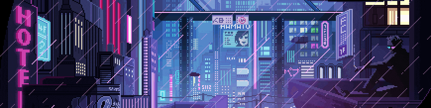

  

<h1 align="center">Hey, I'm YourName 👋</h1>

  <em>Building things in the rain ☔ · pixels · code · neon lights</em>

---

### 🧠 About Me
- 💻 Developer who likes clean code and dirty cyberpunk aesthetics  
- 🎮 Pixel art enjoyer / retro-futurism fan  
- 🌃 Late-night coder energy  

---

### 🛠️ Tech Stack

#### **Languages & Core**

#### **Machine Learning / Data Science**

#### **Web / App Deployment**

#### **Tools & IDEs**

---
### 🏆 LeetCode Stats

  <!-- Overall stats -->
  

  <!-- Top languages solved -->
  

---

### 🌐 Find Me
- 🐦 Twitter: `@yourhandle`
- 🌍 Website: `your-site.dev`

---

  <em>"The city never sleeps — neither do side projects."</em>

